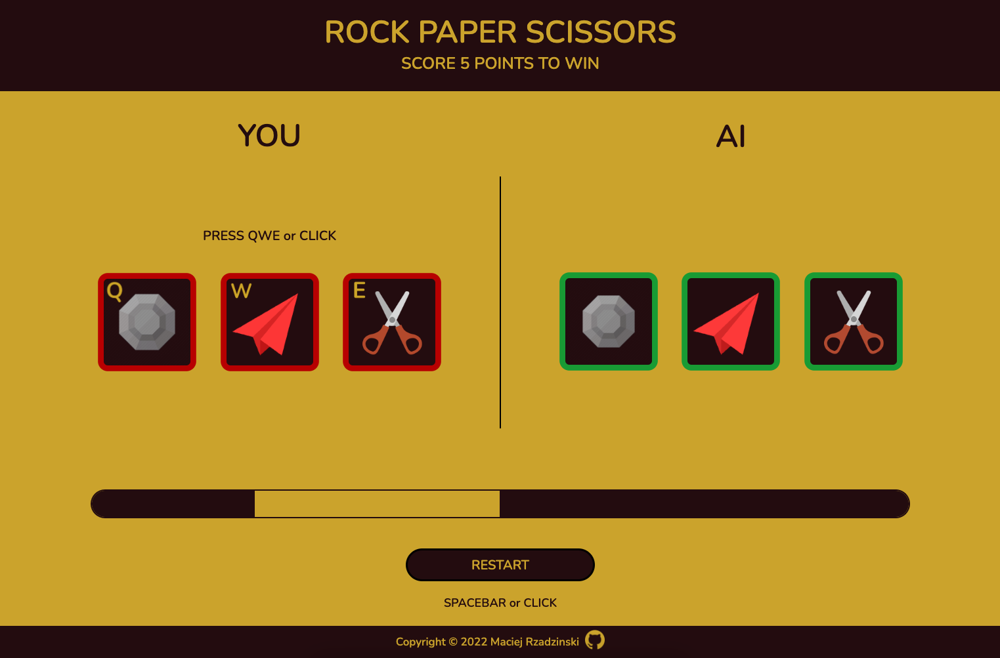

# Rock-Paper-Scissors

[PLAY NOW!](https://mrzadzinski.github.io/rock-paper-scissors/)

Application simulates classic rock-paper-scissors game through minimalistic interface. 

Apart from simple text instructions, visual effects and sound convey all necessary gameplay information.

## Features
* Play using QWE keys or mouse click
* Click RESTART button or press spacebar to restart
* Interactive animations and sound
* Visual score counter for player and computer
* Partially disable interactivity after a finished game

## Technologies
* Javascript
* HTML
* CSS

## Skills practiced
* Javascript - basic syntax and functionality 
* Javascript - DOM Manipulation and Events
* HTML - structure and attributes
* CSS with Flexbox 
* Attempt to write clean and readable code

## Acknowledgments
* This project is an assignment from The Odin Project course:

  * [Rock Paper Scissors](https://www.theodinproject.com/lessons/foundations-rock-paper-scissors) (console version)

  * [Revisiting Rock Paper Scissors](https://www.theodinproject.com/lessons/foundations-revisiting-rock-paper-scissors) (add UI)
  
* [Minimalistic design inspiration](https://jetza99.github.io/rock-paper-scissors/)
* [Score bar inspiration](https://tomsoerr.github.io/odin-rock-paper-scissors/)
* [Github logo animation idea](https://michalosman.github.io/rock-paper-scissors/)